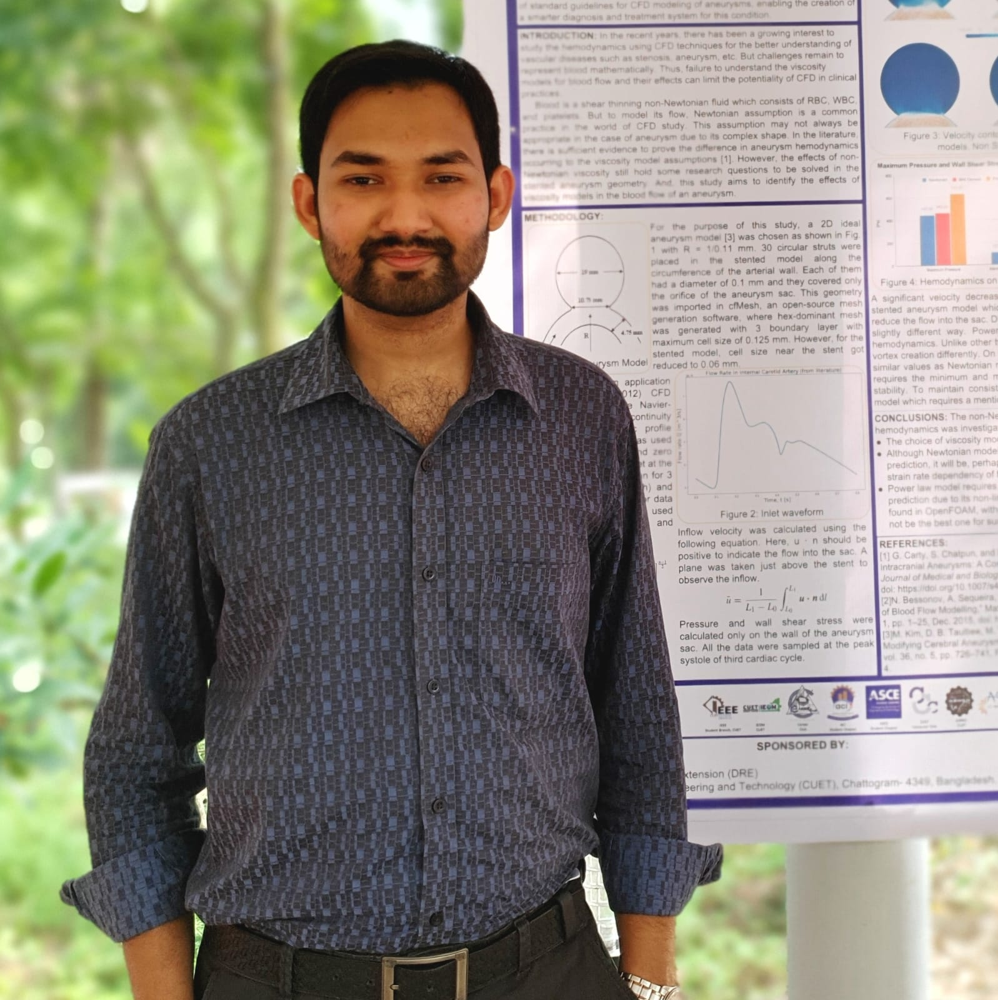

# Welcome!

<!--  -->
~~~

</img>

~~~

Hi! \\I am **Md Ajwad Mohimin**, a recent Mechanical Engineering graduate. My passion lies in **Computational Fluid Dynamics** (CFD) and its applications in understanding complex fluid systems, including the flows within the human body, such as **cardiovascular and cerebrovascular flows**.\\
My undergraduate research works involved flow simulation to understand the hemodynamics inside a patient-specific aneurysm sac. At present, I am working on blood flow simulation in aneurysm under different medical conditions and its treatment option (i.e., flow diverting stents). 

In addition to hemodynamic simulations, I had been involved in projects related to aerodynamics, heat transfer, and turbulent flow. I have practical knowledge of CFD and CAD and proven proficiency in *OpenFOAM, Solidworks, Python, and C++*.
I also feel enthusiastic about integrating **Machine Learning** into CFD to make flow simulation faster and cheaper. \\

My goal is to improve the understanding of physical flow phenomena (including mechanobiology within the human body) using CFD, and I want to continue my journey in research and academia being a supporter of open science and open knowledge.
\\\\
**Education**\\
B.Sc. in Mechanical Engineering, \\*Chittagong University of Engineering and Technology (CUET)*, Bangladesh, 2023.
\\\\
**Current Position**\\
Research Assistant @ CFD Lab, Dept. of Mechanical Engineering, CUET, BD.
\\\\
**Selected Publications / Presentation**\\
* **Md. A. Mohimin**, N. M. Arefin, and P. Das, "Cerebral Aneurysm Hemodynamics In Low Hematocrit Conditions: Numerical Simulations and Analysis," in 14th International Conference on Mechanical Engineering, Dhaka, Bangladesh, Dec. 2023. (Under Review) \\
* **Md. A. Mohimin**, P. Das, and Md. A. I. H. Sharker, "Effect of RANS Turbulence Model on The Hemodynamic Factors in A Middle Cerebral Artery Aneurysm," in 7th International Conference on Mechanical Engineering and Renewable Energy 2023, Chattogram, Bangladesh, Nov. 2023. (Accepted for publication)
* **Md. A. Mohimin**, P. Das, and A. Barua, "Non-Newtonian Effects On Hemodynamics In Stented Model Aneurysm," presented at the Research Fair 2023, CUET, Chattogram-4349, Bangladesh, Aug. 2023. (Poster)
<!-- **Contact**\\ -->
---------------
[LinkedIn](https://www.linkedin.com/in/ajwadmohimin) | Email: [ajwadmohimin@gmail.com](mailto:ajwadmohimin@gmail.com) | [github](https://github.com/ajwadmohimin)

---------------

<!-- **And,** some pretty figures....
~~~

</img>

~~~ -->