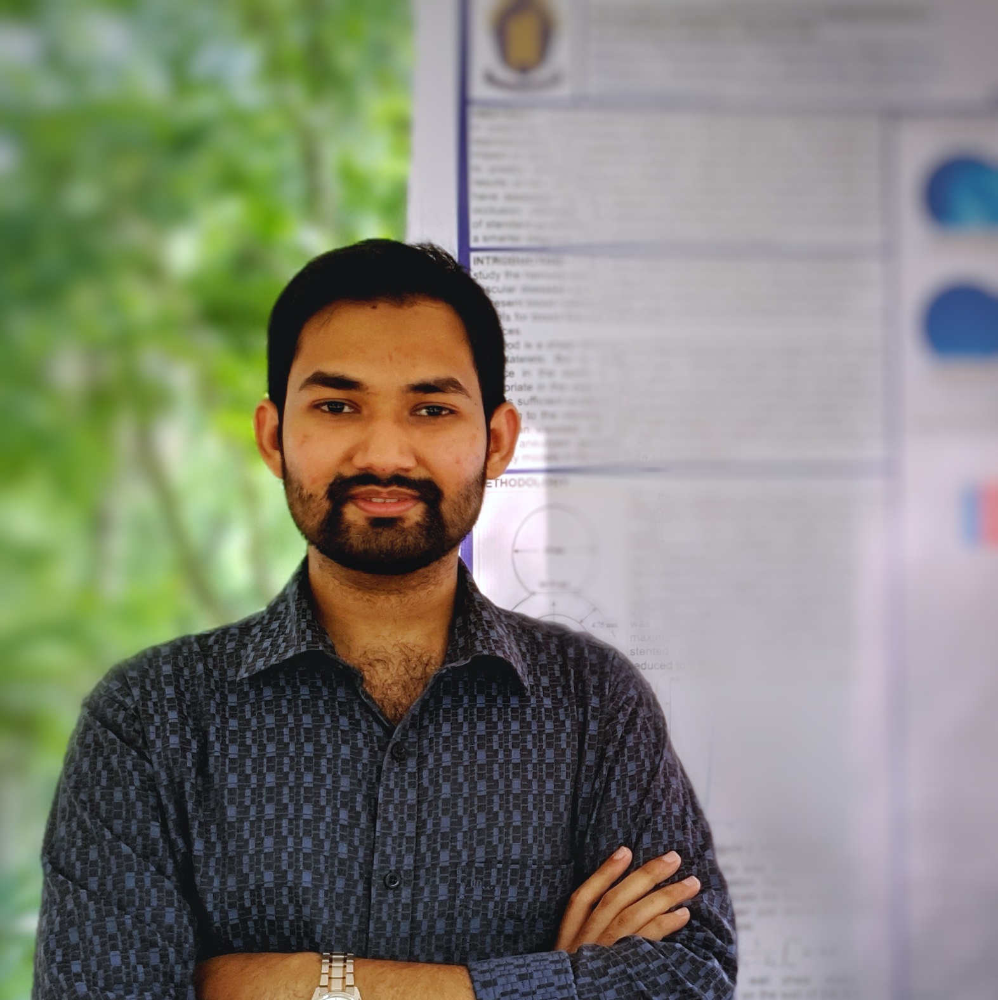

# Welcome!

\\\\
Hi! \\I am **Md Ajwad Mohimin**, a recent Mechanical Engineering graduate. My passion lies in **Computational Fluid Dynamics** (CFD) and its applications in understanding complex fluid systems, including the flows within the human body, such as **cardiovascular and cerebrovascular flows**.\\
My undergraduate research works involved flow simulation to understand the hemodynamics inside a patient-specific aneurysm sac. At present, I am working on blood flow simulation in aneurysm under different medical conditions and its treatment option (i.e., flow diverting stents). In addition to hemodynamic simulations, I feel enthusiastic about integrating **Machine Learning** into CFD to make flow simulation faster and cheaper.

**Education**\\
Bacehlor of Science in Mechanical Engineering, *Chittagong University of Engineering and Technology*, 2023.
\\\\
**Contact**\\
[LinkedIn](https://www.linkedin.com/in/ajwadmohimin) | Email: [ajwadmohimin@gmail.com](mailto:ajwadmohimin@gmail.com)