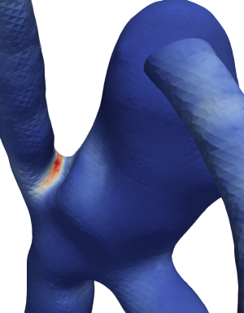

<!-- # Research Statement -->

# Projects
## Hemodynamics in Cerebral Aneurysms
Cerebral Aneurysm is an abnormal bulge in the wall of arteries in the brain. It usually occurs when the layers of the arterial wall get weakened and lose their integrity. Ruptured aneurysms are crucial because they result in subarachnoid hemorrhage which can be life-threatening. Behind the formation, growth, and rupture of an aneurysm, hemodynamics plays a key role. Thus, hemodynamic factors such as Wall Shear Stress, Oscillatory Shear Index, Relative Residence Time, etc. anticipate to predict the status of an aneurysm.\\
This work uses the open-source CFD toolbox *OpenFOAM* paired with patient-specific geometry and pulsatile flow rate to study the hemodynamics in the aneurysm sac. Then, visualization and the extraction of hemodynamic factors were performed using a python script in *Paraview*.
<!--~~~
</img>
~~~-->

[md1](/menu1/)

# Codes
## FasterReconstructPar
This simple project of a few lines of code can speed up the reconstruction of decomposed parallel cases in *OpenFOAM*. Using *Python*, this script launches a series of processes for different ranges of timesteps to reconstruct them.

[github repo](https://github.com/ajwadmohimin/FasterReconstructPar)

## Quemada Viscosity Model for OpenFOAM
The Quemada viscosity model is a quasi-mechanistic viscosity model to predict the flow behavior of non-Newtonian fluids. It is widely used in blood flow simulation to account for the effect of hematocrit level. However, it does not come by default in the *OpenFOAM* package to this date. So, as a part of a vascular flow analysis project, it was implemented in *OpenFOAM*.
